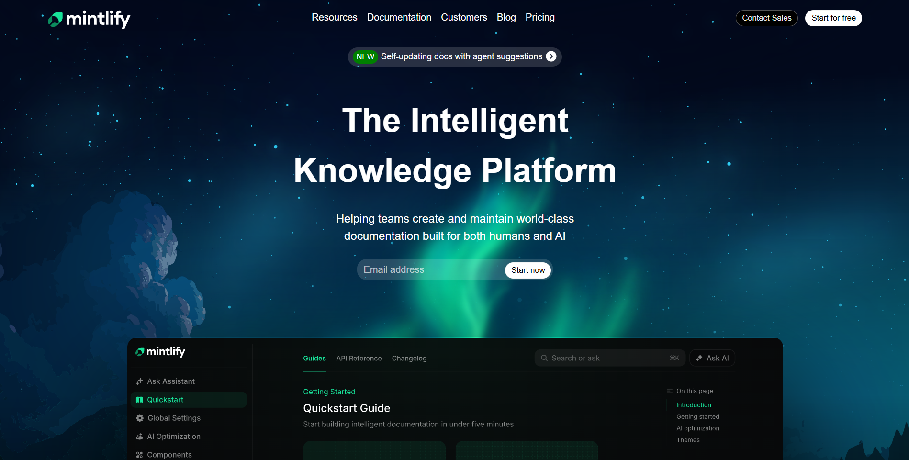
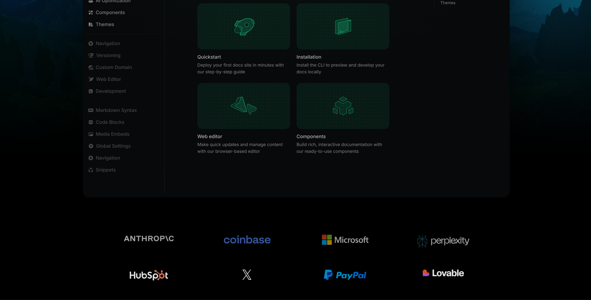
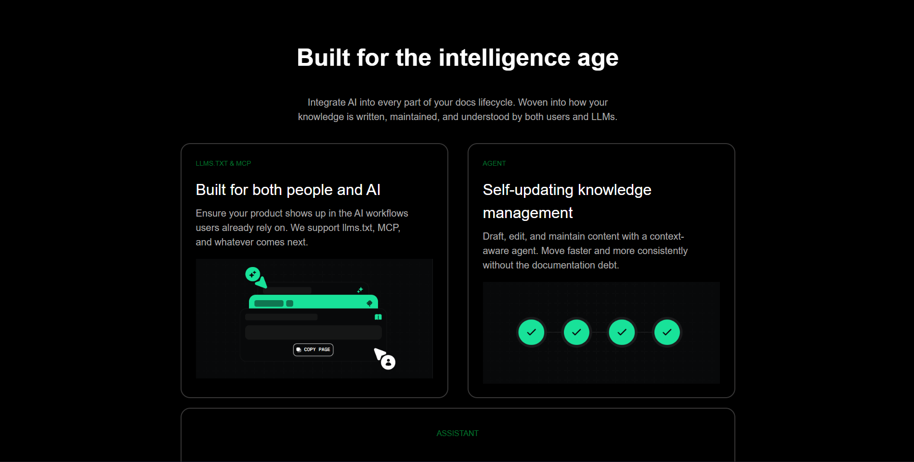
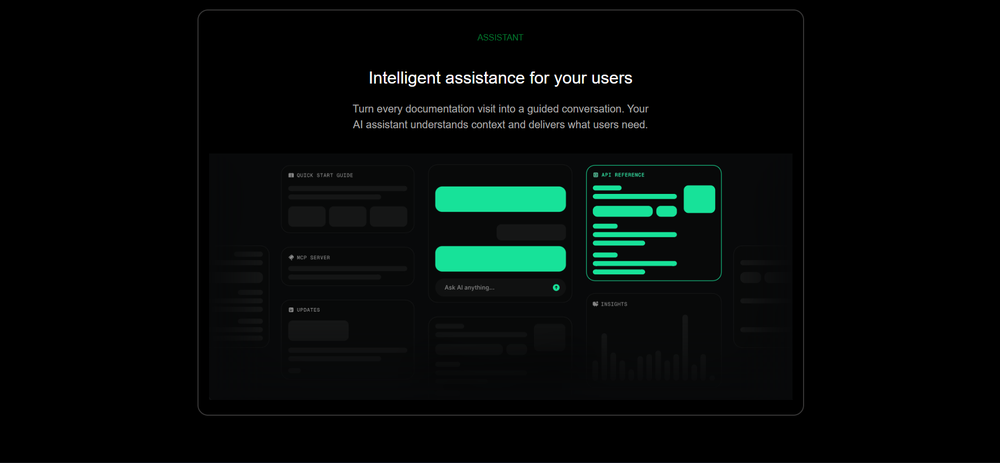
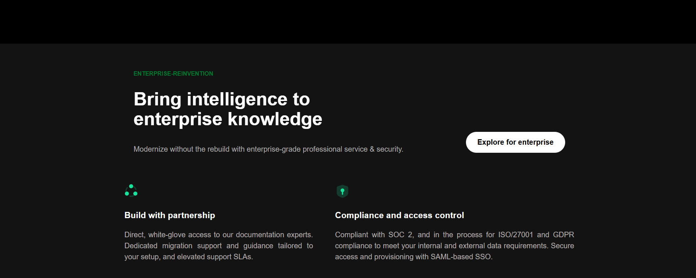
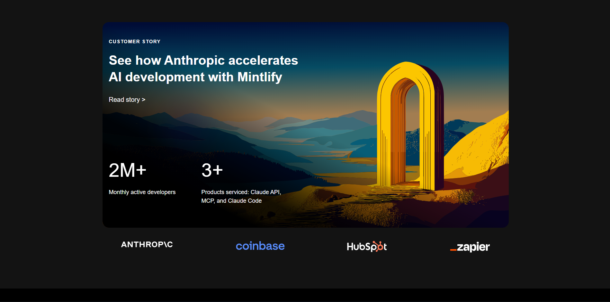
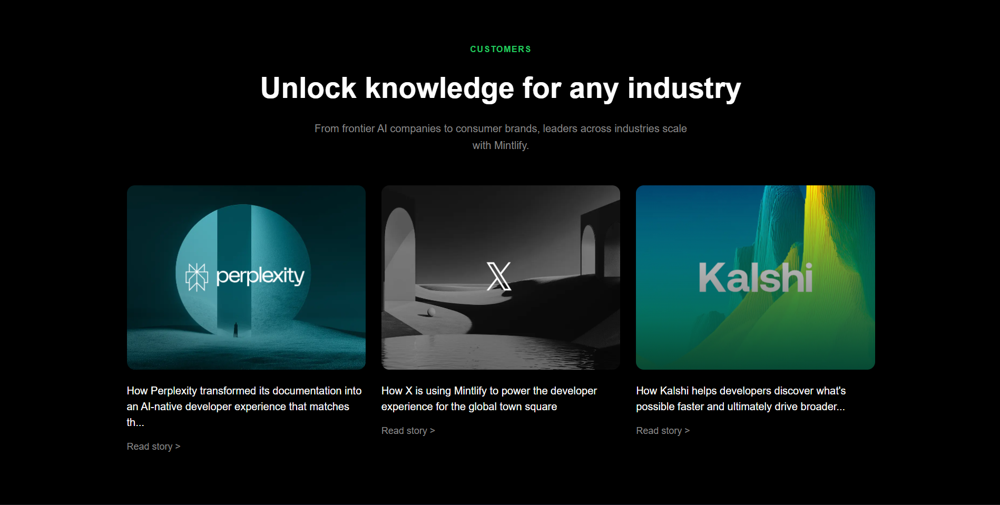
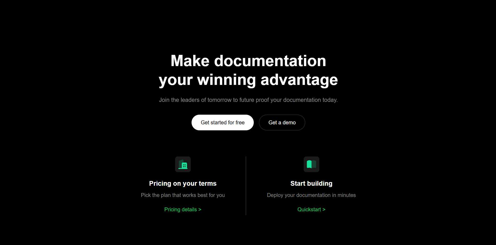

# Mintlify Landing Page Clone - Web Dev Cohort Assignment

A pixel-perfect recreation of the Mintlify documentation platform landing page, built with pure HTML and CSS as part of a Web Development Cohort assignment.

---

## 📋 Project Overview

This project is a desktop-first recreation of the Mintlify.com landing page, focusing on content structure, readability, and layout accuracy. Built as part of a Web Development Cohort assignment with specific constraints: HTML and CSS only, no JavaScript, no animations, and no external CSS frameworks.

**Original Website**: [Mintlify.com](https://mintlify.com)  
**Assignment Focus**: Documentation-style website with emphasis on visual fidelity and professional code structure.

---

## ✅ Sections Implemented

**1. Top Navigation Bar**

- Mintlify logo and wordmark
- Navigation links (Resources, Documentation, Customers, Blog, Pricing)
- Primary and secondary CTA buttons (Contact Sales, Start for free)

**2. Hero Section**

- Main headline: "The Intelligent Knowledge Platform"
- Subheading: "Helping teams create and maintain world-class documentation built for both humans and AI"
- Email input field with "Start now" CTA button
- Large hero background illustration
- Announcement banner: "NEW: Self-updating docs with agent suggestions"

**3. Trusted By / Company Logos**

- Grid layout featuring 8 company logos:
  - Anthropic, Coinbase, Microsoft, Perplexity
  - HubSpot, X.com, PayPal, Lovable

**4. Intelligence Features Section**

- "Built for the intelligence age" heading
- Three feature highlights:
  - **LLMS.TXT & MCP**: "Built for both people and AI"
  - **AGENT**: "Self-updating knowledge management"
  - **ASSISTANT**: "Intelligent assistance for your users"
- Each with detailed descriptions and feature illustrations

**5. Enterprise Section**

- "Enterprise-reinvention" heading
- "Bring intelligence to enterprise knowledge" main heading
- Two enterprise feature blocks:
  - Build with partnership
  - Compliance and access control
- "Explore for enterprise" CTA button

**6. Customer Story Highlight**

- Anthropic customer story card with background image
- Statistics: "2M+ Monthly active developers", "3+ Products serviced"
- "Read story" link
- Brand grid with 4 additional customer logos

**7. Customers Section**

- "CUSTOMERS: Unlock knowledge for any industry" heading
- Three customer story cards with images:
  - Perplexity documentation transformation
  - X developer experience
  - Kalshi developer discovery
- Each with "Read story" links

**8. Final Call-To-Action**

- "Make documentation your winning advantage" heading
- Two CTA buttons: "Get started for free" and "Get a demo"
- Two feature highlights:
  - Pricing on your terms
  - Start building (Quickstart)

**9. Footer**

- Five-column link structure:
  - Explore, Resources, Documentation, Company, Legal
- Social media icons (X, LinkedIn, GitHub)
- Security badge: "AICPA SOC II"
- Status indicator: "All systems normal"
- Theme toggle buttons
- Copyright notice

---

## 🎨 Design System

### Color Palette

- **Primary Background**: `#000000` (Pure Black)
- **Secondary Background**: `#131313` (Dark Gray)
- **Card Backgrounds**: `#0d0d0d` (Darker Gray)
- **Primary Text**: `#ffffff` (White)
- **Secondary Text**: `#888888`, `#abaaaa`, `#b4adad` (Gray variants)
- **Accent Green**: `#02782f`, `#22c55e` (Brand Green)
- **Border Color**: `#78767674` (Translucent Gray)
- **Button Backgrounds**: `#ffffff26` (Translucent White)

### Typography

- **Font Family**: Arial, Helvetica, sans-serif
- **Hero Heading**: 3.5rem, 700 weight
- **Section Headings**: 2.5rem - 2.75rem, 600 weight
- **Feature Headings**: 1.6rem, 500 weight
- **Body Text**: 1rem - 1.2rem
- **Labels**: 0.7rem - 0.8rem, uppercase, 600 weight

### Layout Structure

- **Navigation**: Flexbox with space-between alignment
- **Hero**: Centered content with background image overlay
- **Feature Grids**: CSS Grid (2-column and 3-column layouts)
- **Card Layouts**: Flexbox with consistent spacing
- **Footer**: 5-column CSS Grid with proper spacing

---

## 📁 Project Structure

```
03_mintlify_page/
├── index.html                    # Main HTML structure
├── style.css                     # Complete styling definitions
├── styledemo                     # Development CSS file
├── assets/                       # Images and icons
│   ├── mintlify-wordmark-w.svg   # Main logo
│   ├── hero-image-dark.svg       # Hero background
│   ├── bg-dark.svg              # Background pattern
│   ├── intel-box-1.png          # Feature illustrations
│   ├── intel-box-2.png
│   ├── intel-box-3.png
│   ├── card-1.png               # Customer story images
│   ├── card-2.png
│   ├── card-3.png
│   ├── Anthropicbackground.svg  # Customer story background
│   ├── [company-logos].svg      # Brand logos
│   ├── [interface-icons].svg    # UI icons
│   └── web-shots/               # Project screenshots
│       ├── image1.png
│       ├── image2.png
│       ├── ...
│       └── image9.png
└── README.md                     # This documentation
```

---

## 🔧 Technical Implementation

### HTML Structure

- Semantic HTML5 elements (`<section>`, `<navbar>`, `<footer>`)
- Proper heading hierarchy (H1, H2, H3)
- Accessible image alt attributes
- Clean, semantic class naming conventions
- Logical document structure

### CSS Architecture

- **Global Reset**: Universal box-sizing and margin/padding reset
- **Component-Based Styling**: Modular CSS for reusable components
- **Modern Layout Techniques**:
  - Flexbox for navigation and card layouts
  - CSS Grid for multi-column sections
  - Strategic positioning for overlays
- **Consistent Spacing**: Uniform padding and margin system
- **Hover Effects**: Smooth transitions for interactive elements

### Key CSS Features

- **Background Images**: SVG backgrounds with proper sizing
- **Grid Layouts**: Company logos, customer cards, footer columns
- **Card Components**: Consistent styling with borders and shadows
- **Form Elements**: Styled input fields with placeholder effects
- **Status Indicators**: Custom dot indicators and badges

---

## 📸 Project Screenshots


















---

## 🚀 How to Use

1. Clone or download this repository
2. Open `index.html` in your web browser
3. No build process or dependencies required
4. All assets are included in the `/assets` folder
5. View on desktop (1200px+ recommended for optimal experience)

---

## ✅ Assignment Constraints Followed

**✅ Only HTML and CSS** - No JavaScript used  
**✅ No TailwindCSS** - Pure CSS styling with custom properties  
**✅ No AI Generated Code** - Manually crafted HTML and CSS  
**✅ No Animations** - Static design focused on content  
**✅ No Responsiveness** - Desktop-first layout only  
**✅ Brand-Accurate Assets** - Images and icons matching original design  
**✅ Visual Fidelity** - Pixel-perfect recreation of layout and styling

---

## 🎯 Key Features Accomplished

- **Consistent Dark Theme**: Professional dark design system
- **Modern CSS Grid/Flexbox**: Clean, maintainable layouts
- **Interactive Elements**: Hover states and form interactions
- **Content Hierarchy**: Proper typography scaling and spacing
- **Brand Consistency**: Accurate color scheme and visual elements
- **Professional Code Quality**: Organized, readable CSS structure
- **Asset Management**: Optimized SVG and PNG resources
- **Accessibility Considerations**: Semantic HTML and proper contrast

---

## 📊 Assignment Assessment

**Technologies Used**: HTML5, CSS3  
**Course**: Web Development Cohort 2026  
**Project Type**: Landing Page Recreation  
**Focus Areas**: Visual Design, Code Quality, Attention to Detail

---

## 📚 Resources & References

- **Original Website**: [Mintlify.com](https://mintlify.com)
- **Brand Assets**: Inspired by [brandfetch.com/mintlify.com](https://brandfetch.com/mintlify.com)
- **Development References**: MDN Web Docs, CSS-Tricks
- **Design Inspiration**: Modern documentation platforms

---

## 📝 License

This project is a recreation for educational purposes as part of a Web Development Cohort assignment. All brand assets and content are property of their respective owners.

---

**Note**: This is a learning project created to demonstrate front-end development skills. For official Mintlify documentation platform information, visit [mintlify.com](https://mintlify.com)
